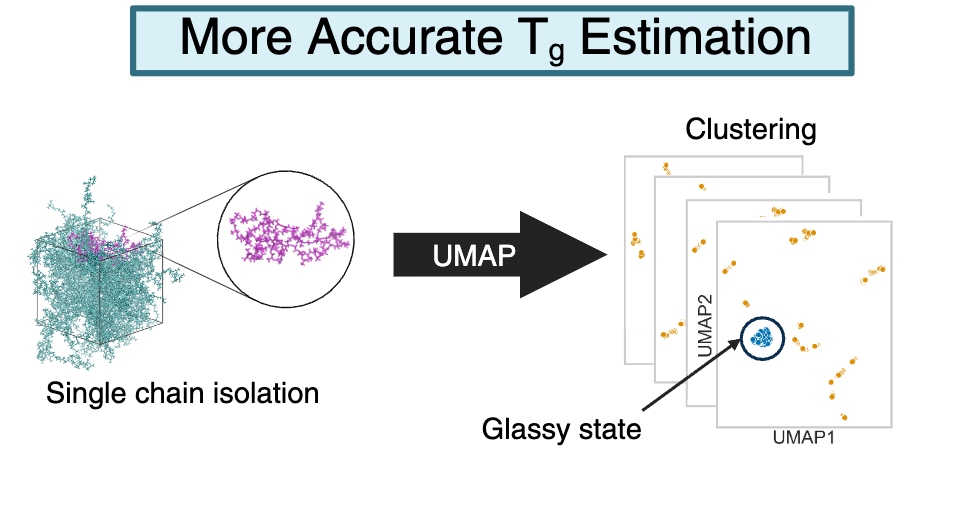

# Automated and reproducible detection of the glass transition temperature with unsupervised machine learning and neural network partial charges
Code repository for Automated and reproducible detection of the glass transition temperature with unsupervised machine learning and neural network partial charges.

[](https://chemrxiv.org/doi/full/10.26434/chemrxiv.10001947/v2)


Scripts to reproduce:
- Polymer melt building
- Annealing ramp
- Analysis using unsupervised machine learning


# Directory Tree
```
.
├── example_scripts
│   ├── build_example.py
│   ├── temperature_ramp_NVT.py
│   ├── temperature_ramp_NPT.py
│   ├── tg_analysis_density.py
│   └── tg_analysis_UMAP.py
└── sample_data_analysis
    ├── UMAP_outputs
    │    └── Folder for each data replicate <POLYMER_CHARGING_DISPERSITY_DATE_TIME> Note: NAGL = AshGC, MBIS = NAGL-MBIS
    ├── monodisperse_sample_visualization.ipynb
    └── polydisperse_sample_visualization.ipynb
```

# Useful Links
[SwiftPol](https://github.com/matta-research-group/SwiftPol) - Used to build polymer ensembles.

[Polyply](https://github.com/marrink-lab/polyply_1.0) - Used for generation of initial coordinates of a polymer melt.

[Open Force Field](https://openforcefield.org/) - Used for parameterization.


